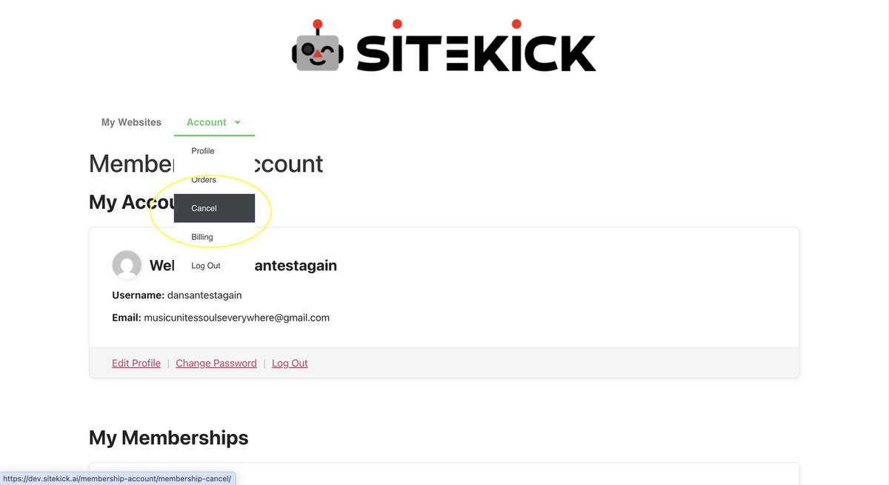
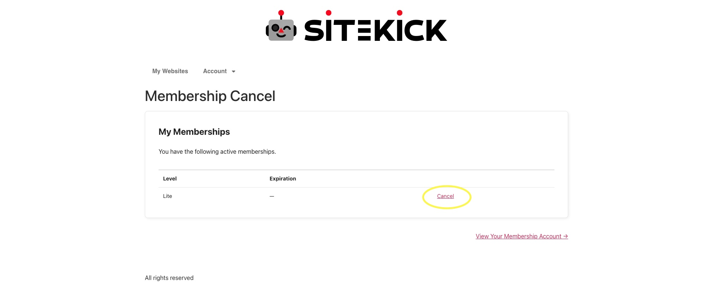
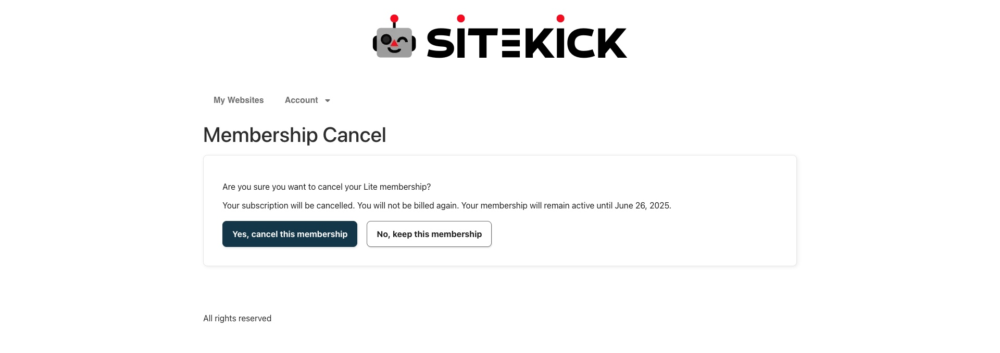

# How can I cancel my subscription?

Just like other subscriptions, you can cancel your account at anytime you'd like, to cancel simply follow the steps below.

1. Log in to your Sitekick.ai account.
2. Once logged in, click the **"Account"** tab on the upper left corner of the website then scroll down and click **"Cancel"**. See screenshot below.

<figure><figcaption></figcaption></figure>

3. You will then be redirected to a "My Memberships" page where you will then click the **"Cancel"** button leading to a confirmation page. Once you confirm the cancellation, your subscription will be fully canceled. Please refer to the images below.

<figure><figcaption></figcaption></figure>

<figure><figcaption></figcaption></figure>

