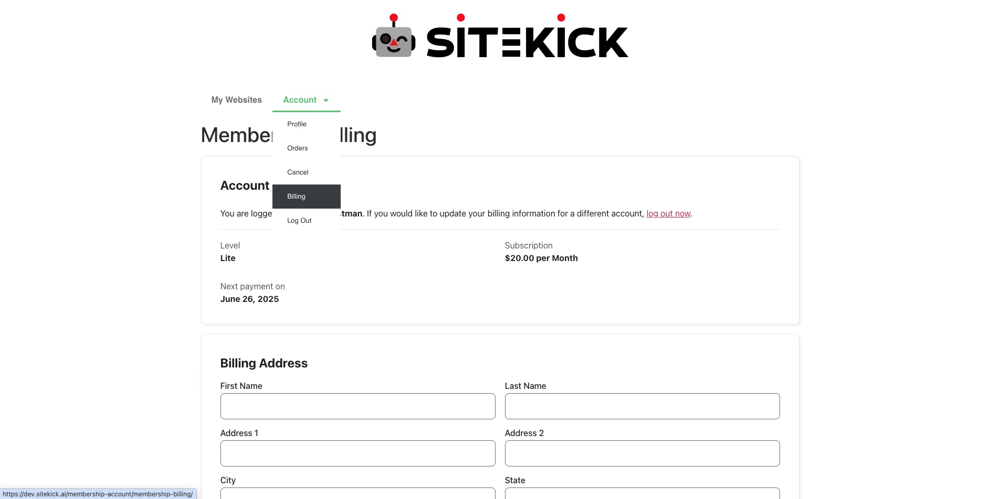
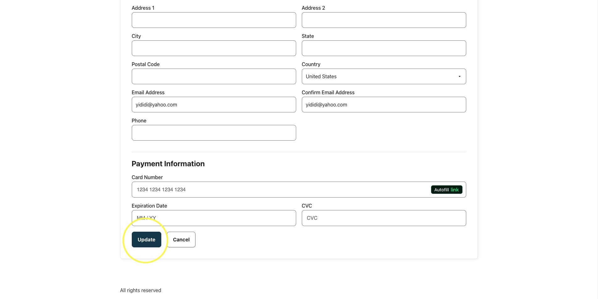

# How can I update my payment method?

If you wish to update your payment method, you can do so easily from your Account dashboard.

1. &#x20;Login to your Sitekick.ai account.
2. &#x20;Once logged in, click the "**Account"** tab on the upper left corner of the page, then click **"Billing"** on the drop-down menu. Please see the screenshot below for reference.

<figure><figcaption></figcaption></figure>

3. &#x20;Once on the **"Billing"** page simply fill in your updated payment method and click the **"Update"** button. Refer to the images below.

<figure><figcaption></figcaption></figure>
