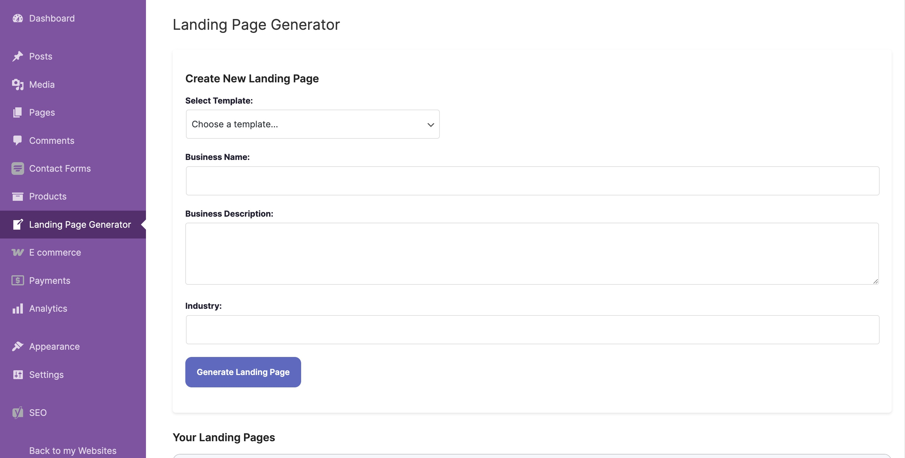
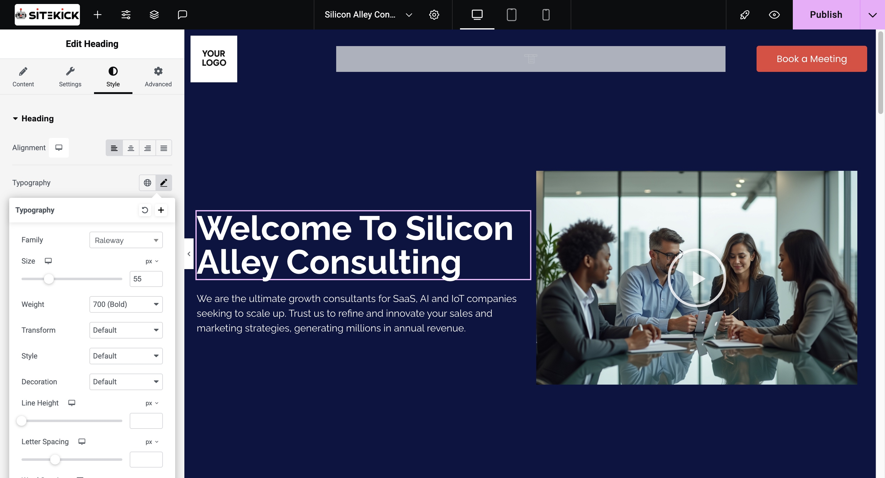

# How does Sitekick work?

Sitekick app has 2 main parts:

**Site Editor**

This helps you to quickly create a landing page or website and populate it with content.

<figure><figcaption></figcaption></figure>

**Design Editor**

This allows you to customize the site, connect your domain, and add any other necessary integrations.

<figure><figcaption></figcaption></figure>
