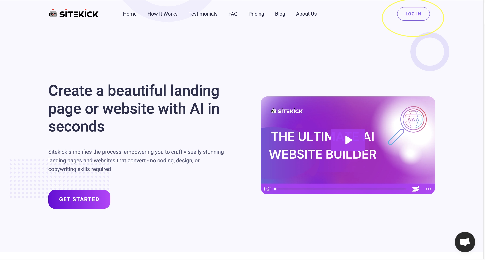
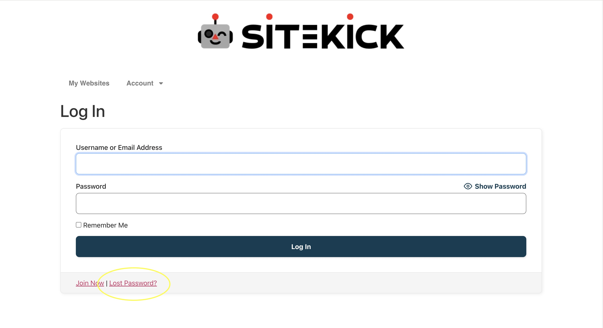
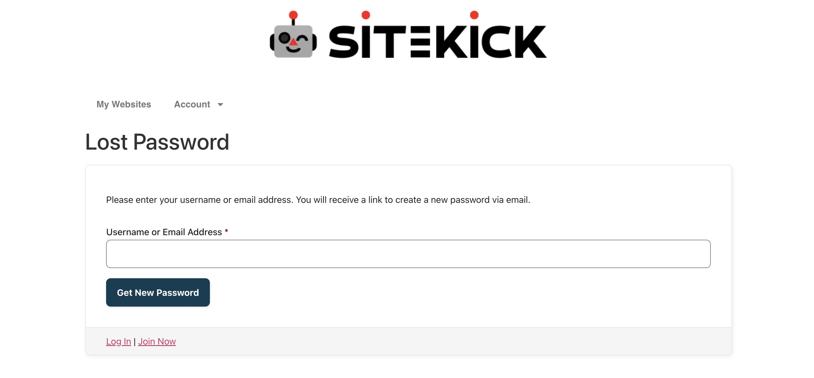

# I forgot my password and can’t log in, how do I reset my password?

In case you forgot your password, you may do the following steps to reset your password.

1. Go to the website, _**https://www.sitekick.ai/**_.
2. Click the "**LOG IN"** button found on the upper right corner of the website.

<figure><figcaption></figcaption></figure>

3. You will be routed to this screen. Click on "**LOSS PASSWORD"**.

<figure><figcaption></figcaption></figure>

4. You will then see a new page (please see the image below). Type in your registered email address, then click the "**GET NEW PASSWORD"** button.

<figure><figcaption></figcaption></figure>

5. Check your email and follow the rest of the instructions provided in the email.
