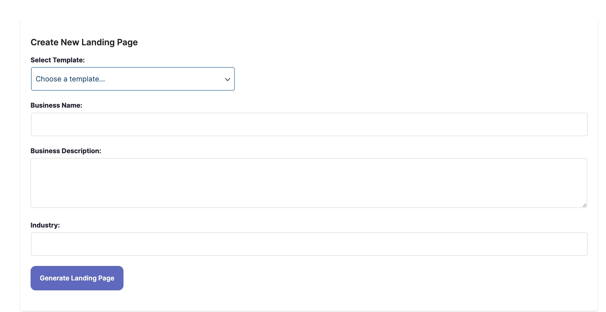

# Choosing a Template

Once you enter the project description,  be sure to choose a template. To select a template, click on the "Select Template" dropdown menu on the top of the AI Page Generator. Choose one of the templates in the dropdown and click "**Generate Landing Page**". &#x20;

You must select a template to be able to generate a page. Please select the one that is the best fit for your corresponding project.

<figure><figcaption></figcaption></figure>
