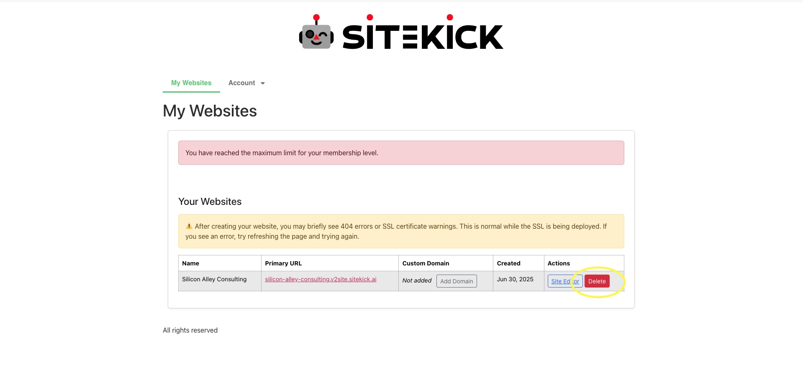
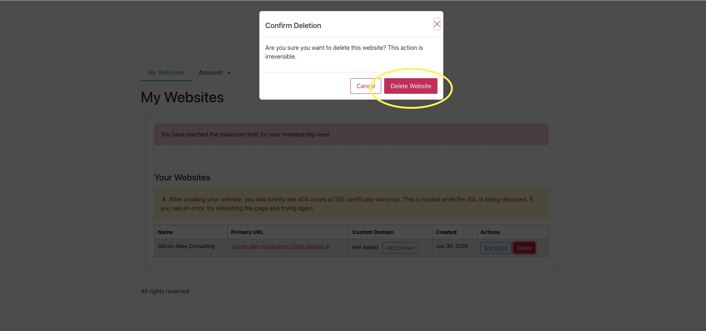

# How do I delete a website?

If you want to delete a website that you no longer want to keep, follow these simple steps.

1. &#x20;After logging into your account, you will see the "My Websites" page, scroll down to your website(s) and click the red "Delete" button on the right under "Actions" next to "Site Editor". (See image below)

<figure><figcaption></figcaption></figure>

2. After clicking the "Delete" button, you will see a pop-up window asking you to confirm if you'd like to proceed with the deletion, press "Delete" again to finalize the deletion of your site. After that, you will be redirected to the "My Websites" page.

<figure><figcaption></figcaption></figure>
