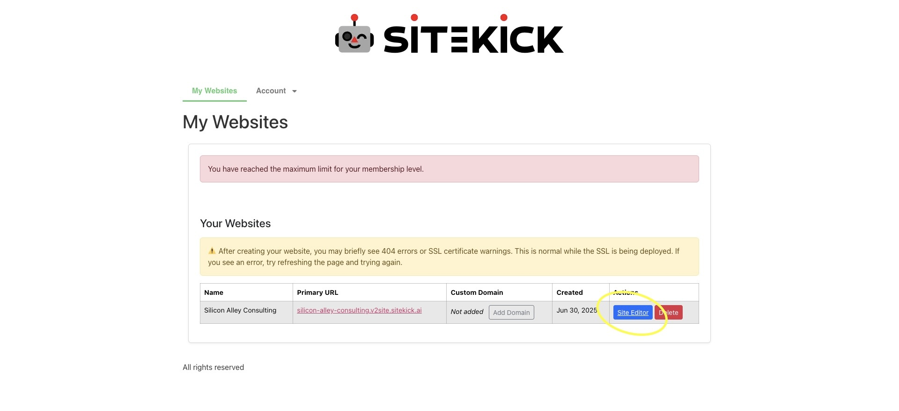
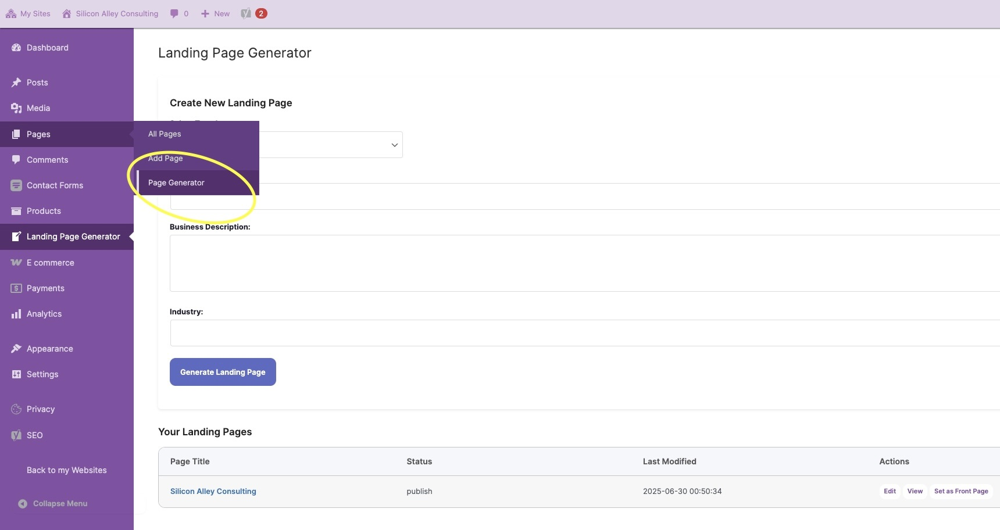
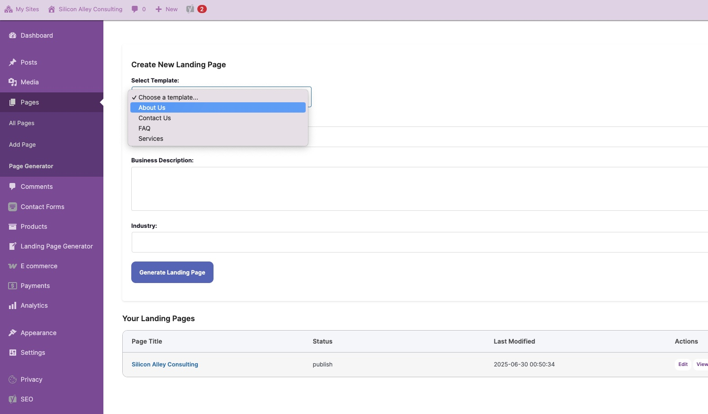

# How do I generate pages for my site?

With the Sitekick AI Site Editor, you can generate individial pages for your site in additional to a Home Page or Landing page. To generate pages such as "About Us", "FAQ", etc. please follow the steps below.

1. Click on the "Site Editor" button next to the site you wish to generate additional pages for.

<figure><figcaption></figcaption></figure>

2. On the left-hand side menu, scroll over the tab that says "Pages", then click "Page Generator".

<figure><figcaption></figcaption></figure>

3. Once you are on the "Page Generator", simply choose your page template, type in your Business Name, Description and Industry then click "Generate Landing Page" to create your page that you can then edit, publish and integrate into your site.

<figure><figcaption></figcaption></figure>
