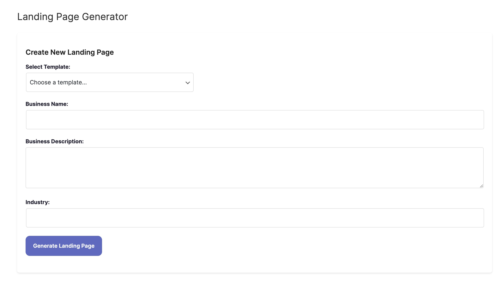

# How do I Generate sites?

Sitekick AI is designed to be very easy to use: Simply choose a template, enter your business name, description, and industry then click the **"Generate Landing Page"** button. Within 3-5 minutes, your landing page or website home page will be fully built by AI.

**Providing a clear and detailed description is essential.**

To achieve better results:

* Include your company name in the description
* Provide as many details as you can
* Try to describe your target audience, market problem, solution, and what makes your product/service unique
* Use at least 20 words

Example:

Sitekick is an AI landing page builder. It allows anyone to build beautiful landing pages, no design, coding or copywriting skills required.

<figure><figcaption></figcaption></figure>
